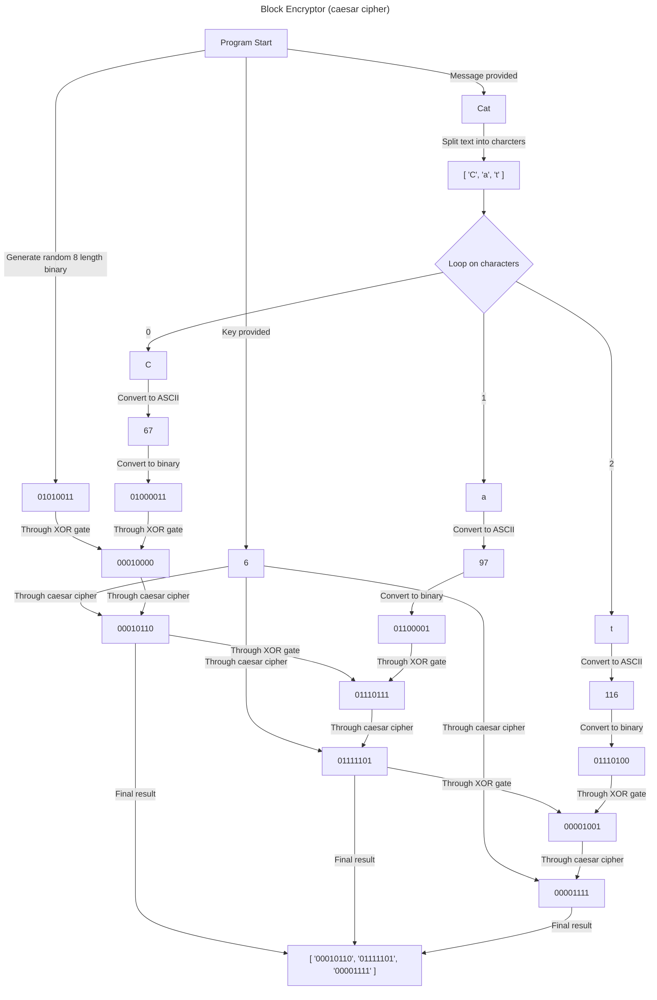

# Block encryption

A simple project to implement block encryption with JavaScript.

## Project layout

The source code for cli can be found in the `cli/` folder with a focus on CLI use. The web version can be found in `src/` and only currently holds basic boiler plate code. For desktop, the relevant code is in `src-tauri/`. The `cli/` folder holds `common.js`, `decrypt.js` and `encrypt.js`.

`common.js` has the functions that are shared for both the encryption process and the decryption process. The exported functions are `XORgate(character, IV)`, `caesarCipher(text, key)` and `vigenereCipher(text, key, operation)`.

`encrypt.js` asks for the text that needs to be encrypted, the encryption key and which cipher to use (you can also pass them in from the command line). The code will log all the information provided and the initialization vector created at the start. If the cipher was the caesar cipher then text is converted to ASCII and then to binary. From there it's put through the XOR gate (IV from the start or last encrypted character if there is one) with finally going through the caesar cipher. Once all the characters have been encrypted the code will logged. For an example see the diagram below. If the cipher is the vigenere cipher then the message is converted to upper case and sent through the vigenere cipher before anything else. After that the process is the same as with the caesar cipher but without using the caesar cipher.

`decrypt.js` asks for the text that needs to be decrypted, the encryption key, the initialization vector and which cipher was used (you can also pass them in from the command line). The code will log all the information provided and will work on decrypting the text.
The code will split each 8 characters into an array and if a caesar cipher was used that will be reversed first with the negative of the provided key. The XOR gate is reversed next with the provided IV or the last decrypted character (if available). The text is converted back from binary to ASCII and then to text. If the vigenere cipher was used then it's reversed and finally the decrypted text is logged.

## Caesar encryption example diagram

